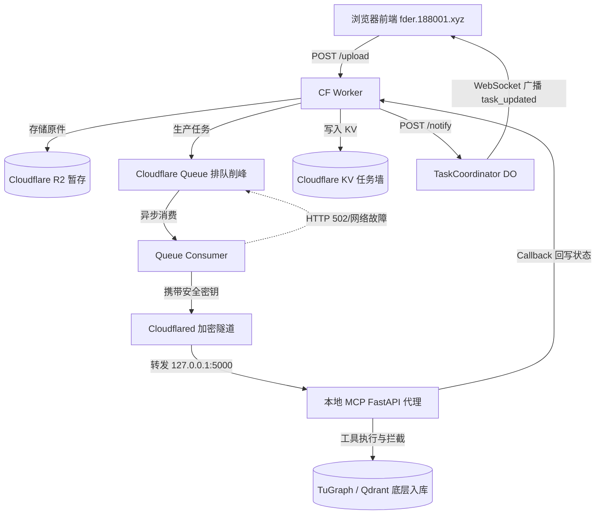

# Lean-GraphRAG: 中小企业轻量级数据资产风控与合规溯源平台 (v3.6)

**本项目是面向中小企业业财合规的轻量级 Lean GraphRAG 架构。采用 CF Workers/Queue 边缘承接并解耦文件录入，通过自定义 MCP（模型上下文协议）服务将本地 TuGraph 与 Qdrant 封装为智能体工具，内置 Cypher 安全护栏与 LIMIT 注入保护数据库；首创“物理审计日志 + HITL 人机协同”闭环，低置信度或异常操作自动流转待审，支持人工修正覆盖灌入，以极低 Token 成本实现高确定性的长尾自治审计。**

本平台是部署于 **Oracle ARM (4C/24G)** 环境下的多业务自主风控研判系统。平台已全面升级为**直连主方案架构（Lean GraphRAG Architecture）**，废除了重型 Java 语义服务（OpenSPG）、MariaDB 关系库与 10 容器的 TuGraph 集群，仅保留轻量级国产图数据库（**TuGraph**）与向量检索库（**Qdrant**）。

整个系统运行常驻内存大幅压缩至 **2GB-4GB**，开发与运维效率获得数量级提升。

---

## 0. 项目状态快照 (2026-06-20 异步前端实时推送闭环已跨过) 📊

> **TL;DR**：3 个业务 agent + 1 个 MCP server (12 tools) + AuditLog + HITL 全跑通。**2026-06-20 重大里程碑**：异步前端全链路闭环，并引入 Cloudflare **Durable Objects** 实时 WebSocket 推送，卸载轮询开销，推送延迟 < 100ms。测试上传 2 个文件均在 10s 内 `completed`。详见白皮书第 7、8、9 节。

### 0.1 当前能力清单

| 维度 | 状态 | 关键证据 |
|---|---|---|
| 业务 Agent | ✅ 3 个跑通 | fraud / shareholding / procurement-audit-mcp |
| MCP Server | ✅ 12 tools | inspection 1 / schema 2 / execution 1 / write 1 / vector 1 / meta 2 / **audit 1** / **hitl 3** |
| LLM 直连 | ✅ MiniMax-M3 | 7/7 问句通过，think 痕迹 0 残留 |
| 图谱 | ✅ TuGraph 4.5.1 | bolt://localhost:7687，11 vertex + 9 edge label |
| 向量库 | ✅ Qdrant 1.18.2 | 字符 n-gram 真接 mail_vectors 76 条真邮件 |
| Cypher 安全护栏 | ✅ 11/11 单测 | DDL 拦截 + CALL db.* 拦截 + 自动 LIMIT 1000 + 8s 超时 |
| 幂等写入 | ✅ | MERGE 模式 + SHA256 缓存重放 |
| 供应商名清洗 | ✅ 12/12 单测 | NFKC + 括号去除 + 12 种后缀剥离 |
| **AuditLog 入图** | ✅ | AuditSession/Action/Ref + 11 顶 9 边，6/6 tool 调用留痕 |
| **HITL 5% 兜底** | ✅ | flag_for_review / list_pending_reviews / manual_commit (approve/reject/override) |
| **CF 异步入队 + 任务看板** | ✅ 已上线 | R2 + Queue + KV + Callback 全链路验证，filename/size 元数据完整 |
| **Durable Objects WebSocket 实时推送** | ✅ **重大里程碑** | 卸载轮询，实时状态广播，延迟 <100ms，`fder.188001.xyz` 线上可用 |
| FastAPI 代理 | 🟡 已写未端到端 | mcp_proxy.py（stdio 3 步握手还差临门一脚） |

### 0.2 治理闭环示意图

```
[业务 agent 调用 MCP tool]
        ↓
[execute_cypher / bulk_insert 留痕到 AuditAction + AuditRef]
        ↓
[异常检测：0 行 / 抛错 / 边约束不符]
        ↓
[flag_for_review → 创建 PendingReview + TRIGGERED 边]
        ↓
[审核员 3 按钮] → approve / reject / override
        ↓                          ↓
        ↓                  [override 模式走 MERGE 灌入]
        ↓                          ↓
        └──────→ [HumanDecision + audit: manual_commit]
```

### 0.3 文件状态

| 文件 | 行数 | 备注 |
|---|---|---|
| `fraud-agent/d_route/agent_llm.py` | 386 + 5 | fraud 复测 5/5 |
| `algorithm-lab/shareholding_agent_tugraph.py` | 380 | UBO 复测 2/2 |
| `procurement-audit-mcp/mcp_server.py` | ≈1100 | 12 tools 全部验证 |
| `procurement-audit-mcp/mcp_proxy.py` | 203 | 🟡 新增，未端到端 |
| **`ingest-worker/src/index.js`** | **≈1220** | **✅ v0.3 — DO + WS + HITL 面板全上线** |
| `ingest-worker/wrangler.toml` | 58 | ✅ 5 binding 含 DO |
| `procurement-audit-mcp/scratch/mcp_writes.jsonl` | - | 幂等键缓存 |
| `procurement-audit-mcp/scratch/audit_session.json` | - | 进程级 session_id 持久化 |

### 0.4 下一步（按 ROI 排）

1. 造一组"真实异常 case"（OCR 错误/实体冲突）触发 HITL 完整路径
2. CF Worker 接 mcp_proxy（白皮书 7.1.2 安全护栏）
3. Cloudflare Access 接入（零信任 SSO，砍自建登录）

---

## 1. 核心底座：大模型数据库安全网关 (TuGraph-Gate) 🛡️

本平台最具商业价值的底层核心是一个名为 **TuGraph-Gate** 的 MCP 服务端。它直接将 TuGraph 与 Qdrant 的底层操作封装为大模型可调用的标准化工具组，彻底解耦了业务智能体与物理数据库的直连代码，并实现了严密的安全管控。

### 1.1 注册工具组清单 (12 Core Tools) ⚙️
服务端向大模型暴露了以下 12 个即插即用的核心工具，覆盖数据勘探、本体建模、安全查询、审计留痕以及人机协同（HITL）全生命周期：

| 工具名称 | 分组 | 危险级别 | 功能说明 |
| :--- | :--- | :--- | :--- |
| `get_raw_data_sample` | 数据探索 | `safe` | 读取本地原始样本数据，供大模型逆向建模学习 |
| `get_graph_schema` | 本体建模 | `safe` | 获取 TuGraph 当前已有的点边标签及属性定义 |
| `create_graph_label` | 本体建模 | `caution` | 动态修改图谱 Schema，向图数据库注入新的点/边 Label |
| `execute_cypher` | 图谱演算 | `caution` | 直连图库运行纯读 Cypher，内置关键字拦截与强制 LIMIT 限制 |
| `bulk_insert_relationships`| 自动建图 | `danger` | 大模型提取三元组后，批量幂等灌入底层关系网络 |
| `search_vector_news` | 向量研判 | `safe` | 直连 Qdrant 检索企业风险舆情，实现图+向量双驱研判 |
| `list_tools`, `describe_tool`| 元数据 | `safe` | 查询本服务所有可用 tool 的详细参数契约与危险等级 |
| `query_audit_actions` | 审计留痕 | `safe` | 查询最近 N 条图谱写入的审计溯源操作记录 |
| `flag_for_review` | 人机协同 | `caution` | 将执行失败/低置信度的操作标为待人工审核，生成 Pending 节点 |
| `list_pending_reviews` | 人机协同 | `safe` | 列出待人工审批的图谱写入任务 |
| `manual_commit` | 人机协同 | `danger` | 审核员对挂起状态做决策 (Approve / Reject / Override 强灌) |

### 1.2 预建骨干与五步自进化 SOP (Schema Governance & Evolution) 🔄
这 12 个工具配合大模型，形成了一套“**既有法治、又有自治**”的图谱生成与写入标准作业流程（SOP）：

**【开端】第 0 步：人工预建骨干表 (Ontology Seeding)**
系统上线前的**绝对前提**。架构师通过脚本预先在 TuGraph 中强制建立最核心的骨干表（如 `Corp`, `Person`, `Contract`）与硬性业务属性（如持股比例 `share`）。这为大模型定下了不可逾越的**“死规矩”**，彻底阻断了“本体无序膨胀”与“造词幻觉”，保障底层硬核算法绝不会因为节点结构变化而跑崩。
👉 **详见专版指南**：[《第0步：核心骨干表构建指南 (Ontology Seeding Guide)》](docs/ontology_seeding_guide.md)

**【自进化】第 1~5 步：大模型面对未知长尾数据的动态适配**
1. **数据探针与特征识别 (Inspection)**：调用 `get_raw_data_sample` 读取未知的原始业务报表，分析列名与数据特征。
2. **本体推理 (Ontology Reasoning)**：LLM 结合业务目标进行语义推理，自动推导周边新增图谱本体（如《高管配偶表》中的 `Spouse`）。
3. **Schema 动态注入 (Seeding)**：调用 `create_graph_label` 自动执行图谱 Schema 结构扩展注册。
4. **状态反馈与对齐查重 (Verification)**：调用 `get_graph_schema` 获取最新的物理结构。**此时大模型必须将抽取到的实体对齐到第 0 步预建的核心骨干表上**（防重叠），再生成标准 JSON 三元组进行安全的 `bulk_insert`。
5. **鲁棒性护栏 (HITL)**：整个生命周期处于严格监控中。如遇低置信度数据或危险 Schema 修改，模型主动调用 `flag_for_review` 拦截，等待人类审核员确认后才由 `manual_commit` 最终落盘。

---

## 2. 数据的异步有效轮转与闭环治理 (Asynchronous Reliable Data Flow) 🗺️

本架构构建了基于 Cloudflare Edge 与本地专属隧道隔离的异步闭环体系，极大地提升了系统的**抗突发流量能力**与**容灾鲁棒性**：



### 核心稳固机制：
1. **“削峰填谷”绝对安全**：前端瞬间涌入千万级合同，系统绝不会打宕本地图数据库。请求被 R2 与 Queue 平滑吸收，按设定速率稳定消费。
2. **“断线重试”机制**：本地网络波动、宕机重启（如抛出 500/502 错误）不会丢失数据。队列消费者会触发 `msg.retry()` 退避重试，一旦本地网络恢复，任务继续流转。
3. **“推拉结合”的零轮询反馈**：写入完成后状态进入 Cloudflare KV，再通过 Durable Objects (DO) 瞬间多播触发 WebSocket 事件。浏览器 UI 无论何时刷新，都能立即对齐最新的异步状态，实现了端到端的完美闭环。


---

## 2. 核心业务 Agent 矩阵 (Agent Matrix) 🤖

平台通过 Python **LangGraph** 状态机进行编排，目前支持两大核心风控研判场景：

### 🛡️ [Fraud-Agent] 金融反欺诈智能体
*   **核心功能**：检测申请人共用设备（`USED_DEVICE`）、共享手机号（`WITH_PHONE`）等异常团伙欺诈行为。
*   **代码路径**：
    *   智能体状态机逻辑：[agent_llm.py](file:///home/ubuntu/tugraph/fraud-agent/d_route/agent_llm.py)
    *   测试问答入口：[demo_llm.py](file:///home/ubuntu/tugraph/fraud-agent/d_route/demo_llm.py)

### 📈 [Shareholding-Agent] 股权穿透与最终受益人 (UBO) 研判智能体
*   **核心功能**：穿透计算多级持股比例（乘积法），追溯 UBO 控制链路，检测循环持股（防死循环）以及披露盲区。
*   **代码路径**：
    *   数据初始化脚本：[seed_shareholding_tugraph.py](file:///home/ubuntu/tugraph/algorithm-lab/seed_shareholding_tugraph.py)
    *   智能体状态机逻辑：[shareholding_agent_tugraph.py](file:///home/ubuntu/tugraph/algorithm-lab/shareholding_agent_tugraph.py)
    *   测试问答入口：[demo_shareholding.py](file:///home/ubuntu/tugraph/algorithm-lab/demo_shareholding.py)

---

## 3. 关键技术点突破 (Technical Highlights) 💡

1.  **推理模型思考痕迹剥离器 (Reasoning Trace Filter)**：
    针对 MiniMax-M3 等推理模型在输出 JSON 或 Cypher 前自动输出的 `<think>...<\/think>` 思维链，新增了正则表达式清洗逻辑，防止 JSON 解码崩溃。
2.  **子图边拉取 + 内存 DFS 路径还原**：
    由于 TuGraph 对于多跳路径查询（`RETURN p`）在 Bolt 序列化传输层存在缺陷，直连主方案在 Cypher 层面拉取相关的扁平边数据，并在 Python 内存中动态构建邻接表进行 DFS 路径重构与环路检测，以 100% 的稳定性绕过了国产数据库底层 Quirks。
3.  **Cypher 参数占位符标准化**：
    修补了 TuGraph 在执行参数化查询时若参数在 Session 中未定义会引发崩溃的限制，直连层自动填充 `None` 占位符进行安全过滤。
4.  **Durable Objects WebSocket 实时推送**：
    每次 `setTaskStatus()` 写 KV 后，fire-and-forget POST 到 `TaskCoordinator` DO 的 `/notify` 端点，DO 实时广播 `{type: "task_updated"}` 到所有活跃 WebSocket 会话，彻底消除前端轮询开销。

---

## 4. 运行与评测指引 (Execution Guide) 🚀

在运行智能体前，请确保已配置 MiniMax 国内月度包月版 API Key 环境变量：
```bash
export MINIMAX_API_KEY="您的 MiniMax API Key"
```

### 4.1 运行金融反欺诈研判 Demo
```bash
python3 /home/ubuntu/tugraph/fraud-agent/d_route/demo_llm.py
```

### 4.2 运行股权穿透与 UBO 研判 Demo
```bash
# 1. 灌入并验证股权测试数据
python3 /home/ubuntu/tugraph/algorithm-lab/seed_shareholding_tugraph.py

# 2. 运行股权研判状态机测试
python3 /home/ubuntu/tugraph/algorithm-lab/demo_shareholding.py
```

---


---

## 6. SOP 与架构手册 (Standard Operating Procedure) 📑

本方案从原始数据提取、Schema 建模、大模型意图提取到图谱/向量双驱的完整实施规范，请查阅专版 SOP 文档：
👉 [极简直连主方案 GraphRAG 架构 SOP 实施手册](file:///home/ubuntu/.gemini/antigravity-cli/brain/ad049765-97c7-444a-902c-bb086dda27fb/lean_graphrag_tugraph_sop.md)

---

## 7. 架构总结与落地心得：解耦与不贬值的数字资产 💡

> **“流水的管道，铁打的本体。”** —— 平台落地核心洞察

在 `Lean-GraphRAG` 架构的建设与验证过程中，我们提炼出了一个极具商业与技术普适性的核心架构哲学：**将核心“数字孪生资产（Ontology）”与底层的“计算/通讯管道（Infrastructure）”彻底解耦**。

在面向不同国家（如中国出海 vs. 境内私有化）、不同合规级别（如民企 SaaS vs. 国央企信创）的交付场景时，除了核心的本体建模资产外，**所有的通道和算力基础设施均可平替（Plug & Play）**：

### 7.1 解耦的三层资产视图

| 层级 | 核心资产内容 (Sovereign Assets) | 物理体现 | 资产属性 |
| :--- | :--- | :--- | :--- |
| **语义与动力学底座** | ① 骨干拓扑（Schema）<br>② 安全红线（Rules）<br>③ 动力学动作（Actions） | TuGraph 顶点/边声明、JSON 描述字典 | **绝对不贬值的核心资产**<br>定义了企业的“因果关系网”，跨平台/大模型完全可移植。 |
| **通讯与状态管道** | 异步队列解耦、实时推送、连接状态维护 | Cloudflare Queue / Durable Objects | **可平替的计算管道**<br>出海/全球版采用 CF Serverless；国内版或私有化可平替为 `TDMQ / RabbitMQ / Redis Stream + Dapr`。 |
| **推理与语义感知** | 结构化数据提取、意图研判、流程微调 | MiniMax / Gemini / Qwen / DeepSeek | **可即插即用的执行引擎**<br>Agent 通过语义标准接口（MCP）操作数据，大模型可以根据合规要求随时切换。 |

### 7.2 基础设施无关性（Infrastructure Independence）

基于此设计，`fder.188001.xyz` 实现了企业级 AI 架构的**“上帝搬家”**自由：
1. **智能体无痛迁移**：由于大模型不直连数据库，而是通过 MCP 工具包（FastMCP）进行语义交互，更换底层大模型不需要重写任何数据库交互代码。
2. **多云与信创平替**：同一套本体逻辑，既能在云端以零成本极速部署（Cloudflare 生态），也能在境内安全信创环境下打包为 Docker 容器，运行于国产 CPU（华为鲲鹏）和操作系统（麒麟 OS）之上。

**真正的数字孪生，不是建立在特定云厂商之上的烟囱应用，而是将企业物理规律和因果链代码化、网络化的本体引擎。**

