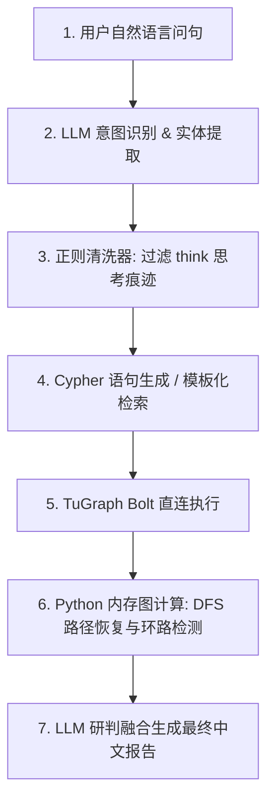

# TuGraph-Intelligence: 极简直连 GraphRAG 智能体平台 (v3.6)

本平台是部署于 **Oracle ARM (4C/24G)** 环境下的多业务自主风控研判系统。平台已全面升级为**直连主方案架构（Lean GraphRAG Architecture）**，废除了重型 Java 语义服务（OpenSPG）、MariaDB 关系库与 10 容器的 NebulaGraph 集群，仅保留轻量级国产图数据库（**TuGraph**）与向量检索库（**Qdrant**）。

整个系统运行常驻内存大幅压缩至 **2GB-4GB**，开发与运维效率获得数量级提升。

---

## 0. 项目状态快照 (2026-06-20 异步前端实时推送闭环已跨过) 📊

> **TL;DR**：3 个业务 agent + 1 个 MCP server (12 tools) + AuditLog + HITL 全跑通。**2026-06-20 重大里程碑**：异步前端全链路闭环，并引入 Cloudflare **Durable Objects** 实时 WebSocket 推送，卸载轮询开销，推送延迟 < 100ms。测试上传 2 个文件均在 10s 内 `completed`。详见白皮书第 7、8 节。

### 0.1 当前能力清单

| 维度 | 状态 | 关键证据 |
|---|---|---|
| 业务 Agent | ✅ 3 个跑通 | fraud / shareholding / procurement-audit-mcp |
| MCP Server | ✅ 12 tools | inspection 1 / schema 2 / execution 1 / write 1 / vector 1 / meta 2 / **audit 1** / **hitl 3** |
| LLM 直连 | ✅ MiniMax-M3 | 7/7 问句通过，think 痕迹 0 残留 |
| 图谱 | ✅ TuGraph 4.5.1 | bolt://localhost:7687，11 vertex + 9 edge label |
| 向量库 | ✅ Qdrant 1.18.2 | 字符 n-gram 真接 mail_vectors 76 条真邮件 |
| Cypher 安全护栏 | ✅ 11/11 单测 | DDL 拦截 + CALL db.* 拦截 + 自动 LIMIT 1000 + 8s 超时 |
| 幂等写入 | ✅ | MERGE 模式 + SHA256 缓存重放 |
| 供应商名清洗 | ✅ 12/12 单测 | NFKC + 括号去除 + 12 种后缀剥离 |
| **AuditLog 入图** | ✅ | AuditSession/Action/Ref + 11 顶 9 边，6/6 tool 调用留痕 |
| **HITL 5% 兜底** | ✅ | flag_for_review / list_pending_reviews / manual_commit (approve/reject/override) |
| **CF 异步入队 + 任务看板** | ✅ 已上线 | R2 + Queue + KV + Callback 全链路验证，filename/size 元数据完整 |
| **Durable Objects WebSocket 实时推送** | ✅ **重大里程碑** | 卸载轮询，实时状态广播，延迟 <100ms，`fder.188001.xyz` 线上可用 |
| FastAPI 代理 | 🟡 已写未端到端 | mcp_proxy.py（stdio 3 步握手还差临门一脚） |

### 0.2 治理闭环示意图

```
[业务 agent 调用 MCP tool]
        ↓
[execute_cypher / bulk_insert 留痕到 AuditAction + AuditRef]
        ↓
[异常检测：0 行 / 抛错 / 边约束不符]
        ↓
[flag_for_review → 创建 PendingReview + TRIGGERED 边]
        ↓
[审核员 3 按钮] → approve / reject / override
        ↓                          ↓
        ↓                  [override 模式走 MERGE 灌入]
        ↓                          ↓
        └──────→ [HumanDecision + audit: manual_commit]
```

### 0.3 文件状态

| 文件 | 行数 | 备注 |
|---|---|---|
| `fraud-agent/d_route/agent_llm.py` | 386 + 5 | fraud 复测 5/5 |
| `algorithm-lab/shareholding_agent_tugraph.py` | 380 | UBO 复测 2/2 |
| `procurement-audit-mcp/mcp_server.py` | ≈1100 | 12 tools 全部验证 |
| `procurement-audit-mcp/mcp_proxy.py` | 203 | 🟡 新增，未端到端 |
| **`ingest-worker/src/index.js`** | **≈1220** | **✅ v0.3 — DO + WS + HITL 面板全上线** |
| `ingest-worker/wrangler.toml` | 58 | ✅ 5 binding 含 DO |
| `procurement-audit-mcp/scratch/mcp_writes.jsonl` | - | 幂等键缓存 |
| `procurement-audit-mcp/scratch/audit_session.json` | - | 进程级 session_id 持久化 |

### 0.4 下一步（按 ROI 排）

1. 造一组"真实异常 case"（OCR 错误/实体冲突）触发 HITL 完整路径
2. CF Worker 接 mcp_proxy（白皮书 7.1.2 安全护栏）
3. Cloudflare Access 接入（零信任 SSO，砍自建登录）

---

## 1. 极简平台架构 (Platform Architecture) 🏗️



### 1.1 双驱底座配置
*   **图数据库 (TuGraph)**: 存储实体拓扑网络，处理多步拓扑路径与持股事实。访问地址：`bolt://localhost:7687` (DB: `default`)。
*   **向量检索库 (Qdrant)**: 负责模糊实体链接与非结构化知识（如舆情、政策文书）检索。访问地址：`http://localhost:6333`。

---

## 2. 核心业务 Agent 矩阵 (Agent Matrix) 🤖

平台通过 Python **LangGraph** 状态机进行编排，目前支持两大核心风控研判场景：

### 🛡️ [Fraud-Agent] 金融反欺诈智能体
*   **核心功能**：检测申请人共用设备（`USED_DEVICE`）、共享手机号（`WITH_PHONE`）等异常团伙欺诈行为。
*   **代码路径**：
    *   智能体状态机逻辑：[agent_llm.py](file:///home/ubuntu/tugraph/fraud-agent/d_route/agent_llm.py)
    *   测试问答入口：[demo_llm.py](file:///home/ubuntu/tugraph/fraud-agent/d_route/demo_llm.py)

### 📈 [Shareholding-Agent] 股权穿透与最终受益人 (UBO) 研判智能体
*   **核心功能**：穿透计算多级持股比例（乘积法），追溯 UBO 控制链路，检测循环持股（防死循环）以及披露盲区。
*   **代码路径**：
    *   数据初始化脚本：[seed_shareholding_tugraph.py](file:///home/ubuntu/tugraph/algorithm-lab/seed_shareholding_tugraph.py)
    *   智能体状态机逻辑：[shareholding_agent_tugraph.py](file:///home/ubuntu/tugraph/algorithm-lab/shareholding_agent_tugraph.py)
    *   测试问答入口：[demo_shareholding.py](file:///home/ubuntu/tugraph/algorithm-lab/demo_shareholding.py)

---

## 3. 关键技术点突破 (Technical Highlights) 💡

1.  **推理模型思考痕迹剥离器 (Reasoning Trace Filter)**：
    针对 MiniMax-M3 等推理模型在输出 JSON 或 Cypher 前自动输出的 `<think>...<\/think>` 思维链，新增了正则表达式清洗逻辑，防止 JSON 解码崩溃。
2.  **子图边拉取 + 内存 DFS 路径还原**：
    由于 TuGraph 对于多跳路径查询（`RETURN p`）在 Bolt 序列化传输层存在缺陷，直连主方案在 Cypher 层面拉取相关的扁平边数据，并在 Python 内存中动态构建邻接表进行 DFS 路径重构与环路检测，以 100% 的稳定性绕过了国产数据库底层 Quirks。
3.  **Cypher 参数占位符标准化**：
    修补了 TuGraph 在执行参数化查询时若参数在 Session 中未定义会引发崩溃的限制，直连层自动填充 `None` 占位符进行安全过滤。
4.  **Durable Objects WebSocket 实时推送**：
    每次 `setTaskStatus()` 写 KV 后，fire-and-forget POST 到 `TaskCoordinator` DO 的 `/notify` 端点，DO 实时广播 `{type: "task_updated"}` 到所有活跃 WebSocket 会话，彻底消除前端轮询开销。

---

## 4. 运行与评测指引 (Execution Guide) 🚀

在运行智能体前，请确保已配置 MiniMax 国内月度包月版 API Key 环境变量：
```bash
export MINIMAX_API_KEY="您的 MiniMax API Key"
```

### 4.1 运行金融反欺诈研判 Demo
```bash
python3 /home/ubuntu/tugraph/fraud-agent/d_route/demo_llm.py
```

### 4.2 运行股权穿透与 UBO 研判 Demo
```bash
# 1. 灌入并验证股权测试数据
python3 /home/ubuntu/tugraph/algorithm-lab/seed_shareholding_tugraph.py

# 2. 运行股权研判状态机测试
python3 /home/ubuntu/tugraph/algorithm-lab/demo_shareholding.py
```

---

## 5. 异步数据录入与实时审计反馈架构 🗺️

> **🏆 2026-06-20 重大里程碑**：全链路闭环 + Durable Objects WebSocket 实时推送已全部验证上线（`fder.188001.xyz`）。

平台构建了**基于 Cloudflare Edge 与本地专属隧道双向隔离的异步闭环体系**，并通过 **Durable Objects** 实现零轮询的实时状态同步：

```
[浏览器 fder.188001.xyz]
     │  WebSocket wss://fder.188001.xyz/api/ws
     │◄────────────────────────────────────────┐
     │                                         │
     │ POST /api/upload           [TaskCoordinator DO]
     ▼                                         │ broadcast task_updated
[CF Worker]──R2 暂存──►[CF Queue]  POST /notify ──┘
     │                     │          ▲
     │ 初始化 KV queued     │       setTaskStatus()
     ▼                     ▼          │
[CF KV 状态库]      [Queue Consumer]───┘
     ▲                     │
     │ Callback completed  ▼
     └────────────[本地 VPS :5000 FastAPI]
                          │
                    (双引擎灌入)
                    ▼         ▼
               [Qdrant]   [TuGraph]
```

1.  **统一入口 (`fder.188001.xyz`)**: CF Worker 托管前端 Dashboard + 提供全部 API 端点，域名已自定义绑定。
2.  **Cloudflare Queue 异步流控**: 文件解析任务通过边缘队列排队，支持自动错误重试与并发限制，防爆削峰。
3.  **Durable Objects 实时推送 (v0.3)**: `TaskCoordinator` DO 维护所有在线 WebSocket 会话池。每次 `setTaskStatus()` 写 KV 后同步向 DO 发送 `POST /notify`，DO 将 `{type: "task_updated", task}` 广播至全部活跃会话。**零轮询，推送延迟 < 100ms**。
4.  **5% 兜底与 HITL 协同**: `pending_manual_review` 状态由前端 HITL 面板接管，提供 approve / reject / override 三按钮极简操作，override 数据复用 MERGE + 幂等机制写回 TuGraph / Qdrant 并全程留 AuditAction 审计边。

> 详细设计请参阅白皮书（第 7、8 节已更新为 DO WebSocket 现状）：
> 👉 [Lean GraphRAG 异步数据摄取与合同审计架构白皮书](file:///home/ubuntu/tugraph/docs/whitepaper_async_ingest.md)

---

## 6. SOP 与架构手册 (Standard Operating Procedure) 📑

本方案从原始数据提取、Schema 建模、大模型意图提取到图谱/向量双驱的完整实施规范，请查阅专版 SOP 文档：
👉 [极简直连主方案 GraphRAG 架构 SOP 实施手册](file:///home/ubuntu/.gemini/antigravity-cli/brain/ad049765-97c7-444a-902c-bb086dda27fb/lean_graphrag_tugraph_sop.md)

