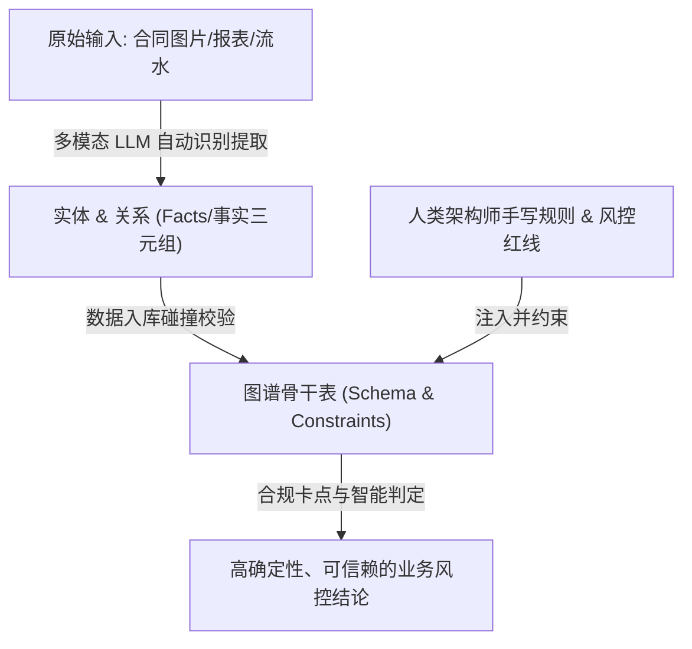

# 核心骨干表构建指南 (Ontology Seeding Guide)

在 TuGraph-Gate 大模型图谱网关架构中，“本体无序膨胀”与“大模型造词幻觉”是导致下游图计算算法（如股权穿透、UBO计算）崩溃的致命元凶。

为了彻底解决这一问题，本架构引入了 **“第 0 步：人工预建骨干表 (Ontology Seeding)”** 机制。该机制要求数据架构师在系统上线前，通过 Python 脚本将核心业务的“底线思维”以强 Schema 的形式硬编码固化到 TuGraph 中。

本文档将详细说明数据架构师如何使用 Python 语言编写核心骨干表的初始化脚本。

---

## 1. 原理与选型

* **工具语言**：`Python 3`
* **驱动包**：`neo4j` (官方 Bolt 协议客户端)
* **核心语法**：放弃传统的 Cypher `CREATE`，强制调用 TuGraph 底层的原生存储过程（`CALL db.createVertexLabelByJson` 和 `CALL db.createEdgeLabelByJson`），以实现毫秒级的强约束注入。

---

## 2. 脚本编写核心拆解

### 第一步：建立安全的高速连接
TuGraph 完美兼容国际标准的 Bolt 协议。架构师可以直接使用 Neo4j 驱动包建立长连接。

```python
import json
from neo4j import GraphDatabase

# 数据库连接配置 (TuGraph 默认 Bolt 端口为 7687)
URI = "bolt://localhost:7687"
USER = "admin"
PASSWORD = "YOUR_TUGRAPH_PASSWORD"

# 初始化驱动实例
driver = GraphDatabase.driver(URI, auth=(USER, PASSWORD))
```

### 第二步：定义强类型的“实体”（点表 Vertex）
在 TuGraph 中建立实体骨干表时，必须严格指定**主键（Primary Key）**和**非空约束**。这是防止大模型抽取相同企业时发生“节点影分身”的物理保障。

```python
def create_core_vertex_labels(session):
    print("正在建立【Corp】企业骨干表...")
    
    # 严格定义 Schema JSON
    corp_schema = {
        "label": "Corp",
        "primary": "corp_id",  # 强约束：必须有唯一的 corp_id 主键
        "type": "VERTEX",
        "properties": [
            {
                "name": "corp_id", 
                "type": "STRING", 
                "is_primary": True, 
                "is_unique": True, 
                "is_notnull": True,
                "max_length": 100
            },
            {
                "name": "name", 
                "type": "STRING", 
                "is_notnull": False
            }
        ]
    }
    
    # 通过存储过程注入
    cmd = f"CALL db.createVertexLabelByJson('{json.dumps(corp_schema)}')"
    session.run(cmd)
    print("  -> Corp 表建立成功！")
```

### 第三步：定义带“物理边界约束”的“关系”（边表 Edge）
定义关系表是整个过程中**最关键的一环**。架构师必须通过 `constraints` 阵列死死限制住哪些实体可以连线。如果大模型企图将不符合逻辑的实体串联（例如 `[合同]-持股->[公司]`），底层引擎会直接拒绝并抛错。

```python
def create_core_edge_labels(session):
    print("正在建立【hold_share】持股关系骨干表...")
    
    hold_share_schema = {
        "label": "hold_share",
        "type": "EDGE",
        # 【核心约束】: 规定起点和终点必须是下面这两种组合
        "constraints": [
            ["Person", "Corp"],   # 自然人 持股 公司
            ["Corp", "Corp"]      # 公司 持股 公司
        ],
        "properties": [
            {
                # 【算法护栏】: 强制规定持股比例必须是 DOUBLE 浮点数
                # 逼迫大模型将 "百分之十" 转换为 0.10，确保下游 UBO 乘积运算不报错
                "name": "share", 
                "type": "DOUBLE", 
                "is_notnull": False
            }
        ]
    }
    
    cmd = f"CALL db.createEdgeLabelByJson('{json.dumps(hold_share_schema)}')"
    session.run(cmd)
    print("  -> hold_share 表建立成功！")
```

### 第四步：一键统筹与执行
在 Python 的入口点中，将上述流程串联，确保在一个独立的 Database Session 中干净利落地完成初始化。

```python
if __name__ == "__main__":
    print("=== 开始执行 TuGraph 核心骨干表(Ontology Seeding)注入 ===")
    try:
        # 使用默认的 default 图空间
        with driver.session(database="default") as session:
            create_core_vertex_labels(session)
            create_core_edge_labels(session)
        print("=== 核心骨干本体初始化完毕！地基已打好！ ===")
    except Exception as e:
        print(f"初始化失败，请检查 TuGraph 状态或 Schema 是否已存在: {e}")
    finally:
        driver.close()
```

---

## 3. 为什么不让大模型来写这一步？

1. **底线不容试错**：核心业务节点（如企业、资金流水、合同、人）是硬核图谱算法（如连通子图、深度优先搜索提取路径）的基石。如果让大模型自由发挥，它可能会因为上下游语境的变化，将 `Corp` 写成 `Company` 或者 `Enterprise`，导致下游 Python 分析脚本大面积崩溃。
2. **混合建模（Hybrid Modeling）才是未来**：通过本文档描述的 **Python 脚本**，人类架构师负责搭建“不可逾越的四面承重墙”（手写核心本体）；而后续业务中无穷无尽的长尾场景（如新增《车辆信息表》），则通过 MCP Tools 工具完全放权给大模型在墙内自由地“自主动态扩建”。

这种“**第 0 步法治兜底 + 第 1~5 步自治扩张**”的设计，正是本系统能够在商业场景中具备极高可用性的杀手锏。

---

## 4. 骨干表规则设计的“深度”与“广度”哲学 (Depth & Breadth Philosophy)

为了兼顾“数据资产刚性底线”与“中小企业业务高灵活性”，预定义骨干表时的规则设计应遵循以下深度与广度的权衡艺术：

### 4.1 规则设计的“深度”：硬性骨架 vs. 弹性血肉
我们应将规则分为两个层次，以避免 Schema 过于僵化导致系统无法应对多变的长尾业务：
* **骨架层：底线规则（硬约束，数据库内核执行）**
  * **定义标准**：仅定义**“概念层面的不变量 (Domain Invariants)”**。如主键唯一性 (`is_unique`，发票不能影分身)、非空约束 (`is_notnull`)、拓扑方向约束 (`constraints`，如 `Payment` 必须指向 `Invoice`，禁止倒转或乱连) 等。
  * **作用**：这些规则极度稳定，不随具体商业政策而变，直接交由 TuGraph 引擎底层卡死，从而建立起不可逾越的数据“物理法案”。
* **血肉层：业务逻辑规则（软约束，大模型/Agent 动态校验）**
  * **定义标准**：所有可能会变、因人而异、或存在灰色地带的规则（例如“发票税率必须为 13%”、“核销金额与实付金额必须绝对对齐”）。
  * **作用**：绝对不写进图 Schema 骨干，而是由 **Agent 逻辑层**（如 LangGraph）在运行期做动态校验。若有异常，则系统生成 `PendingReview`（待审核）节点，由人机协同（HITL）流转判定。当业务政策变更时，只需修改 Agent 逻辑，无需重构底层数据库。

### 4.2 规则设计的“广度”：最小可行图谱 (Minimum Viable Graph)
在覆盖的业务范围上，应坚持 **“以痛点为圆心，以两步路径 (2-Hop) 为半径”** 的“最小可行图谱”原则：
* **小步快跑，渐进扩展**：初期仅围绕最痛的那个场景（如“财务审计”）定义极少的骨干实体（如 `Corp`、`Contract`、`Invoice`、`Payment`）。
* **平滑扩展，底座复用**：当企业涌现出新诉求（如“供应商背景穿透/反舞弊”）时，只需在原有的核心 `Corp` 骨干节点上，“嫁接”新的实体（如 `Employee`）和关系，原有财务流数据无需发生任何更改。整个图谱将随着业务发展像活体细胞一样平滑生长。

---

## 5. AIGC 时代下三元化架构的终极分工 (The Ultimate Division of Labor in AIGC Era)

随着多模态大模型（Multimodal LLMs）的发展，AI 已经能够极其高效地直接读取图片、扫描件和复杂报表表格，并自动抽取其中的实体和关系。然而，**“规则”依然必须由人类专家去书写和夯实**，因为那是企业多年沉淀的专属风控逻辑、行业 know-how 与安全红线。

这催生了三元化数据资产架构下的**终极人机分工模式**：

### 5.1 多模态大模型：扮演“手和眼”（感知与事实提取）
* **职责**：负责高效率、低成本地对海量非结构化数据进行语义识别。
* **动作**：从发票照片、合同扫描件或银行流水中，直接抽取事实（Facts）级别的“实体”与“关系”三元组，替代过去繁琐的人工初审与数据录入。

### 5.2 人类架构师：扮演“骨架与大脑”（规则定义与合规底线）
* **职责**：负责将企业多年积累的专属风控政策、行业禁忌、合规标准进行逻辑抽象与刚性固化。
* **动作**：通过代码或配置定义核心骨干表（`Schema`）与 Agent 校验约束，为数据流动构建不可逾越的物理护栏。

### 5.3 终极分工的架构鸟瞰



通过这种分工，**多模态大模型解决了数据资产化过程中的“效率问题”，而人类手写的规则骨架则解决了“确定性与合规问题”**。这是确保企业数据资产真正能够被安全留存与放心消费的黄金法则。
