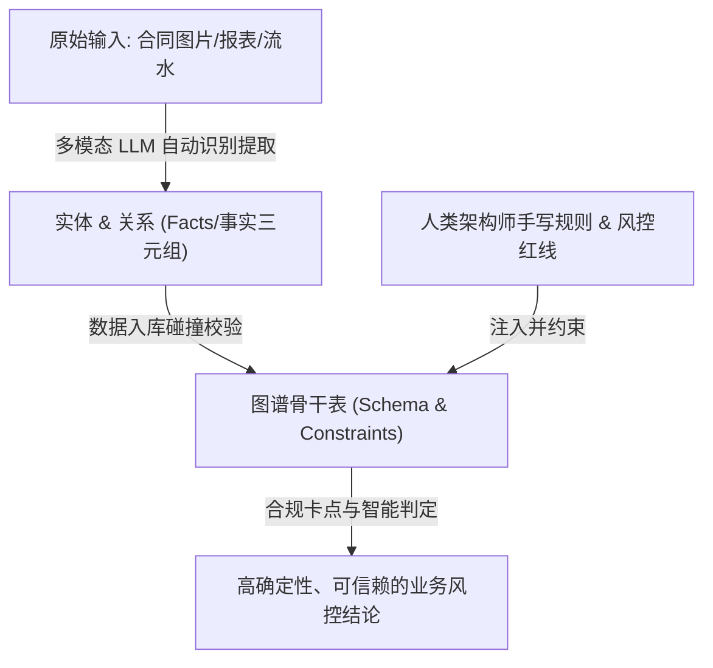
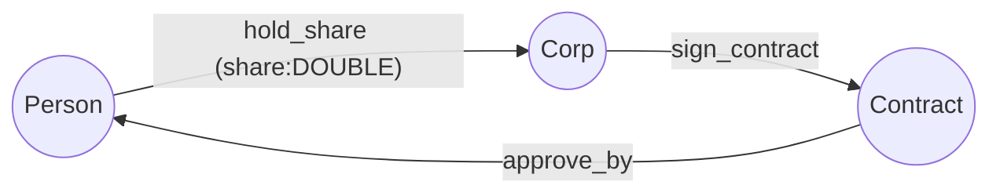

# 核心骨干表构建指南 (Ontology Seeding Guide)

在 TuGraph-Gate 大模型图谱网关架构中，“本体无序膨胀”与“大模型造词幻觉”是导致下游图计算算法（如股权穿透、UBO计算）崩溃的致命元凶。

为了彻底解决这一问题，本架构引入了 **“第 0 步：人工预建骨干表 (Ontology Seeding)”** 机制。该机制要求数据架构师在系统上线前，通过 Python 脚本将核心业务的“底线思维”以强 Schema 的形式硬编码固化到 TuGraph 中。

本文档将详细说明数据架构师如何使用 Python 语言编写核心骨干表的初始化脚本。

---

## 1. 原理与选型

* **工具语言**：`Python 3`
* **驱动包**：`neo4j` (官方 Bolt 协议客户端)
* **核心语法**：放弃传统的 Cypher `CREATE`，强制调用 TuGraph 底层的原生存储过程（`CALL db.createVertexLabelByJson` 和 `CALL db.createEdgeLabelByJson`），以实现毫秒级的强约束注入。

---

## 2. 脚本编写核心拆解

### 第一步：建立安全的高速连接
TuGraph 完美兼容国际标准的 Bolt 协议。架构师可以直接使用 Neo4j 驱动包建立长连接。

```python
import json
from neo4j import GraphDatabase

# 数据库连接配置 (TuGraph 默认 Bolt 端口为 7687)
URI = "bolt://localhost:7687"
USER = "admin"
PASSWORD = "YOUR_TUGRAPH_PASSWORD"

# 初始化驱动实例
driver = GraphDatabase.driver(URI, auth=(USER, PASSWORD))
```

### 第二步：定义强类型的“实体”（点表 Vertex）
在 TuGraph 中建立实体骨干表时，必须严格指定**主键（Primary Key）**和**非空约束**。这是防止大模型抽取相同企业时发生“节点影分身”的物理保障。

```python
def create_core_vertex_labels(session):
    print("正在建立【Corp】企业骨干表...")
    
    # 严格定义 Schema JSON
    corp_schema = {
        "label": "Corp",
        "primary": "corp_id",  # 强约束：必须有唯一的 corp_id 主键
        "type": "VERTEX",
        "properties": [
            {
                "name": "corp_id", 
                "type": "STRING", 
                "is_primary": True, 
                "is_unique": True, 
                "is_notnull": True,
                "max_length": 100
            },
            {
                "name": "name", 
                "type": "STRING", 
                "is_notnull": False
            }
        ]
    }
    
    # 通过存储过程注入
    cmd = f"CALL db.createVertexLabelByJson('{json.dumps(corp_schema)}')"
    session.run(cmd)
    print("  -> Corp 表建立成功！")
```

### 第三步：定义带“物理边界约束”的“关系”（边表 Edge）
定义关系表是整个过程中**最关键的一环**。架构师必须通过 `constraints` 阵列死死限制住哪些实体可以连线。如果大模型企图将不符合逻辑的实体串联（例如 `[合同]-持股->[公司]`），底层引擎会直接拒绝并抛错。

```python
def create_core_edge_labels(session):
    print("正在建立【hold_share】持股关系骨干表...")
    
    hold_share_schema = {
        "label": "hold_share",
        "type": "EDGE",
        # 【核心约束】: 规定起点和终点必须是下面这两种组合
        "constraints": [
            ["Person", "Corp"],   # 自然人 持股 公司
            ["Corp", "Corp"]      # 公司 持股 公司
        ],
        "properties": [
            {
                # 【算法护栏】: 强制规定持股比例必须是 DOUBLE 浮点数
                # 逼迫大模型将 "百分之十" 转换为 0.10，确保下游 UBO 乘积运算不报错
                "name": "share", 
                "type": "DOUBLE", 
                "is_notnull": False
            }
        ]
    }
    
    cmd = f"CALL db.createEdgeLabelByJson('{json.dumps(hold_share_schema)}')"
    session.run(cmd)
    print("  -> hold_share 表建立成功！")
```

### 第四步：一键统筹与执行
在 Python 的入口点中，将上述流程串联，确保在一个独立的 Database Session 中干净利落地完成初始化。

```python
if __name__ == "__main__":
    print("=== 开始执行 TuGraph 核心骨干表(Ontology Seeding)注入 ===")
    try:
        # 使用默认的 default 图空间
        with driver.session(database="default") as session:
            create_core_vertex_labels(session)
            create_core_edge_labels(session)
        print("=== 核心骨干本体初始化完毕！地基已打好！ ===")
    except Exception as e:
        print(f"初始化失败，请检查 TuGraph 状态或 Schema 是否已存在: {e}")
    finally:
        driver.close()
```

---

## 3. 为什么不让大模型来写这一步？

1. **底线不容试错**：核心业务节点（如企业、资金流水、合同、人）是硬核图谱算法（如连通子图、深度优先搜索提取路径）的基石。如果让大模型自由发挥，它可能会因为上下游语境的变化，将 `Corp` 写成 `Company` 或者 `Enterprise`，导致下游 Python 分析脚本大面积崩溃。
2. **混合建模（Hybrid Modeling）才是未来**：通过本文档描述的 **Python 脚本**，人类架构师负责搭建“不可逾越的四面承重墙”（手写核心本体）；而后续业务中无穷无尽的长尾场景（如新增《车辆信息表》），则通过 MCP Tools 工具完全放权给大模型在墙内自由地“自主动态扩建”。

这种“**第 0 步法治兜底 + 第 1~5 步自治扩张**”的设计，正是本系统能够在商业场景中具备极高可用性的杀手锏。

## 3.5 骨干表的三段式 (Three-Layer View)

每个骨干表由 **3 段** 组成, 由内到外, 越内越不能动:

| 段 | 角色 | 在 `hold_share` 里的体现 | 谁能动 |
|---|---|---|---|
| **骨架 (Schema)** | 实体 + 关系 label 名 | `Person`, `Corp`, `hold_share` 3 个 label | 架构师 (人工) |
| **宪法 (Constraints)** | 边连接约束 + 主键约束 + 类型约束 | `Person→Corp` + `Corp→Corp`; `share: DOUBLE`; `corp_id` 唯一非空 | 架构师 (人工) |
| **附言 (Properties)** | 可选属性, 描述性字段 | `name` (可空), `note`, `summary` | LLM 可补, 错了可清洗 |

**附言是血肉, 错了可改; 骨架 + 宪法是底线, 推倒重来。**

**实操原则**:

- 骨架和宪法**永远人工写**——LLM 只能在这两段内工作 (5 步 SOP 第 2-5 步)
- 附言**让 LLM 抽**——抽错不致命, 进 HITL 兜底
- 任何 schema 变更分清楚**改的是哪一段**:
  - 改骨架 (新加 label) → 走 5 步 SOP, 人工审
  - 改宪法 (改边约束/主键/类型) → **慎重**, 通常意味着业务逻辑变了
  - 改附言 (新加可空字段) → 安全, 任意时点可做

这个三段式与 §4 骨架/血肉的"深度哲学"是同一件事的两种表达——三段式偏"写代码时怎么分", 深度哲学偏"为什么这么分"。

---

---

## 4. 骨干表规则设计的“深度”与“广度”哲学 (Depth & Breadth Philosophy)

为了兼顾“数据资产刚性底线”与“中小企业业务高灵活性”，预定义骨干表时的规则设计应遵循以下深度与广度的权衡艺术：

### 4.1 规则设计的“深度”：硬性骨架 vs. 弹性血肉
我们应将规则分为两个层次，以避免 Schema 过于僵化导致系统无法应对多变的长尾业务：
* **骨架层：底线规则（硬约束，数据库内核执行）**
  * **定义标准**：仅定义**“概念层面的不变量 (Domain Invariants)”**。如主键唯一性 (`is_unique`，发票不能影分身)、非空约束 (`is_notnull`)、拓扑方向约束 (`constraints`，如 `Payment` 必须指向 `Invoice`，禁止倒转或乱连) 等。
  * **作用**：这些规则极度稳定，不随具体商业政策而变，直接交由 TuGraph 引擎底层卡死，从而建立起不可逾越的数据“物理法案”。
* **血肉层：业务逻辑规则（软约束，大模型/Agent 动态校验）**
  * **定义标准**：所有可能会变、因人而异、或存在灰色地带的规则（例如“发票税率必须为 13%”、“核销金额与实付金额必须绝对对齐”）。
  * **作用**：绝对不写进图 Schema 骨干，而是由 **Agent 逻辑层**（如 LangGraph）在运行期做动态校验。若有异常，则系统生成 `PendingReview`（待审核）节点，由人机协同（HITL）流转判定。当业务政策变更时，只需修改 Agent 逻辑，无需重构底层数据库。

### 4.2 规则设计的“广度”：最小可行图谱 (Minimum Viable Graph)
在覆盖的业务范围上，应坚持 **“以痛点为圆心，以两步路径 (2-Hop) 为半径”** 的“最小可行图谱”原则：
* **小步快跑，渐进扩展**：初期仅围绕最痛的那个场景（如“财务审计”）定义极少的骨干实体（如 `Corp`、`Contract`、`Invoice`、`Payment`）。
* **平滑扩展，底座复用**：当企业涌现出新诉求（如“供应商背景穿透/反舞弊”）时，只需在原有的核心 `Corp` 骨干节点上，“嫁接”新的实体（如 `Employee`）和关系，原有财务流数据无需发生任何更改。整个图谱将随着业务发展像活体细胞一样平滑生长。

## 5. 骨干表深度解析: 应付账款场景 (Invoice / Payment / Contract / Corp)

股权场景 (`hold_share`) 是"金融小切口"——演示穿透算法。**应付账款是"中小企最痛的小切口"**——每家公司都有对账、虚开、回款风险, 一听就懂。

### 5.1 三段式拆分 (按 §3.5 视角)

#### 骨架 (Schema)
4 个 VERTEX + 6 条 EDGE, 完整的"合同→发票→付款"三方核对流:

| VERTEX | 主键 | 关键附言 | 业务角色 |
|---|---|---|---|
| `Contract` | `contract_id` | `title`, `amount`, `payment_terms` | 采购合同 (业务源头) |
| `Invoice`  | `invoice_id`  | `amount`, `issue_date`, `due_date` | 发票 (业务凭证) |
| `Payment`  | `payment_id`  | `amount`, `pay_date`, `method` | 付款 (业务动作) |
| `Corp`     | `corp_id`     | `name` | 供应商 / 客户 (业务主体) |

6 条 EDGE 构成完整业务链:

```
HAS_INVOICE     Contract → Invoice        合同下挂发票 (一对多)
ISSUED_BY       Invoice  → Corp           发票由谁开 (供应商 Corp)
ISSUED_TO       Invoice  → Corp           发票开给谁 (客户 Corp)
PAID_BY         Payment  → Corp           付款方 (客户 Corp)
PAID_TO         Payment  → Corp           收款方 (供应商 Corp)
MATCHED_INVOICE Payment  → Invoice        付款核销到发票 (一对多)
```

#### 宪法 (Constraints) — 6 条硬规则, 物理层强制

| 宪法规则 | 在哪 | 业务含义 |
|---|---|---|
| `Invoice→Corp` 单向 (`ISSUED_BY` / `ISSUED_TO`) | TuGraph `constraints` | 发票必须由供应商开、开给客户, 禁止乱连 |
| `Payment→Corp` 单向 (`PAID_BY` / `PAID_TO`) | 同上 | 付款必须有付款方和收款方, 禁止 `Payment→Payment` |
| `HAS_INVOICE` 单向 (`Contract→Invoice`) | 同上 | 合同才能挂发票, 禁止"无合同发票" |
| `MATCHED_INVOICE` 单向 (`Payment→Invoice`) | 同上 | 付款必须核销到具体发票, 禁止"凭空付款" |
| 主键业务码化 | `is_unique` + `is_notnull` | `invoice_id` / `payment_id` 来自客户财务系统, 不换自增 ID |
| 边方向**不可逆** | `constraints` 单向 | 物理保证"付款不会从发票倒推到合同"——数据流向单一 |

#### 附言 (Properties) — 可以错可改

- `Invoice.amount` — 发票金额
- `Payment.amount` — 付款金额
- `Contract.amount` — 合同金额
- `Contract.payment_terms` — 付款条件 (LLM 抽错就进 HITL, 不致命)

**附言错了没事**——清洗。**宪法错了就崩**——比如把 `MATCHED_INVOICE` 改成双向, 对账算法会死循环。

### 5.2 业务规则 (软宪法, 写在算法/Agent 层)

按 §4 深度哲学, 这些**不**写进 schema, 由 LangGraph Agent 跑时校验:

| 规则 | 实现位置 | 触发场景 |
|---|---|---|
| **三方对账** | `execute_cypher` 查 `Contract.amount = SUM(Invoice.amount) = SUM(PAID Payment.amount)` | 演示: "找出合同金额 ≠ 发票金额" |
| **虚开检测** | 同一供应商 30 天内发票金额突增 5x | HITL 兜底 |
| **重复付款** | 同一 `Invoice` 被 `MATCHED_INVOICE` 多次指向 | 必报警 |
| **逾期未付** | `Invoice.due_date < now AND 未被 MATCHED_INVOICE` | 现金流预警 |

### 5.3 跟 `hold_share` 的对比

| 维度 | `hold_share` | 应付账款 (Invoice/Payment) |
|---|---|---|
| **业务痛点** | 股权穿透 (金融场景) | **每家中企都有的痛**——对账、虚开、回款风险 |
| **客户认知门槛** | 高 (需要懂股权) | 低 (采购/财务一听就懂) |
| **演示动线丰富度** | 单一路径 (DFS 穿透) | **3 条独立业务流** (合同→发票→付款 双向核对) |
| **算法护栏** | DFS 环路检测 | **三方对账** (合同金额 ≥ 发票金额 ≥ 已付金额) |
| **HITL 触发场景** | 循环持股 | 虚开发票 / 重复付款 / 超额付款 |
| **白板讲故事** | 难 | **极易**——画"供应商-合同-发票-付款"4 个方块 |

### 5.4 演示中怎么讲 (白板 + 5 分钟)

#### 白板画法

```
                  ┌──────────────┐
                  │ Corp (供应商) │◀──── ISSUED_BY ─────┐
                  └──────┬───────┘                       │
                         │                          ┌────┴─────┐
                    sign_contract                   │ Invoice  │
                         │                          └────┬─────┘
                         ▼                               │ HAS_INVOICE
                  ┌──────────────┐ ◀───────────────────┘
                  │  Contract    │   MATCHED_INVOICE
                  │  (amount)    │         ▲
                  └──────┬───────┘         │
                         │            ┌────┴─────┐
                         │            │ Payment  │
                         │            └────┬─────┘
                         │                 │
                         ▼    PAID_BY / PAID_TO
                  ┌──────────────┐
                  │ Corp (客户)  │
                  └──────────────┘
```

#### 演示动线 (10 分钟)

1. **第 1 分钟** — 白板画图 (4 个方块 + 6 条线)
2. **第 2 分钟** — 讲"合同→发票→付款"三方对账业务含义
3. **第 3 分钟** — 跑 `execute_cypher` 查"找出对账不平的合同"
4. **第 4 分钟** — 讲 6 条硬宪法 (边约束 + 方向不可逆)
5. **第 5 分钟** — 讲 4 条软规则 + HITL 兜底 (虚开/重复/超额进待审核)
6. **第 6-10 分钟** — 客户问题

### 5.5 跟你其他骨干表的关系

```
hold_share  (股权穿透)         — 金融场景, 演示 UBO 算法
应付账款 (Invoice/Payment)     — 中小企最痛, 演示对账    ← 本节
USED_DEVICE / WITH_PHONE       — 金融场景, 演示团伙检测
Audit* (11 顶 9 边)            — 治理闭环, 所有场景通用
```

**4 个场景的骨干表加起来 = 你的"企业本体数字孪生"**。每加一个场景, 就是在 `Corp` / `Person` / `Contract` 核心实体上"嫁接"新边——§4.2 说的"底座复用, 平滑生长"。

---

## 6. AIGC 时代下三元化架构的终极分工 (The Ultimate Division of Labor in AIGC Era)

随着多模态大模型（Multimodal LLMs）的发展，AI 已经能够极其高效地直接读取图片、扫描件和复杂报表表格，并自动抽取其中的实体和关系。然而，**“规则”依然必须由人类专家去书写和夯实**，因为那是企业多年沉淀的专属风控逻辑、行业 know-how 与安全红线。

这催生了三元化数据资产架构下的**终极人机分工模式**：

### 6.1 多模态大模型：扮演“手和眼”（感知与事实提取）
* **职责**：负责高效率、低成本地对海量非结构化数据进行语义识别。
* **动作**：从发票照片、合同扫描件或银行流水中，直接抽取事实（Facts）级别的“实体”与“关系”三元组，替代过去繁琐的人工初审与数据录入。

### 6.2 人类架构师：扮演“骨架与大脑”（规则定义与合规底线）
* **职责**：负责将企业多年积累的专属风控政策、行业禁忌、合规标准进行逻辑抽象与刚性固化。
* **动作**：通过代码或配置定义核心骨干表（`Schema`）与 Agent 校验约束，为数据流动构建不可逾越的物理护栏。

### 6.3 终极分工的架构鸟瞰



通过这种分工，**多模态大模型解决了数据资产化过程中的“效率问题”，而人类手写的规则骨架则解决了“确定性与合规问题”**。这是确保企业数据资产真正能够被安全留存与放心消费的黄金法则。

## 7. 未来演进: 架构师画拓扑图, LLM 组织骨干脚本 (Topology-First Authoring)

**当前 §2-3 的痛点**: 架构师要手写 `db.createVertexLabelByJson` 的 JSON 字符串 + 4 步 Python 模板——"写字典式 Cypher"。LLM 经常越界造词, 5 步 SOP 第 1 步摩擦大。

**未来 1 步**: 架构师画 1 张拓扑图 (Mermaid / draw.io / yEd), LLM 读图后组织出可跑的 `seed_*.py` 脚本, 人工 review 后落库。

### 6.1 架构师画什么 (人工定)

只画**骨架 + 宪法** (本节 §3.5 三段式的前 2 段):

- **骨架**: 实体圆圈 + 关系带箭头连线
- **宪法**: 连线上的边约束 (起点→终点) + 边上的关键属性类型 (如 `share: DOUBLE`)

**附言 (name, summary, note) 不画**——LLM 自己从客户 Excel 抽。

### 6.2 LLM 干什么 (机器做)

把图翻译成可跑的 `seed_*.py`:

- 圆圈 → `db.createVertexLabelByJson` 调用
- 箭头 → `db.createEdgeLabelByJson` 调用, 自动带 `constraints`
- 边上标注的 `xxx: TYPE` → edge properties
- 套用 §2 第四步的入口模板

### 6.3 Mermaid 示例 → 期望输出

**架构师画的图**:



**LLM 翻译出的 seed_xxx.py** (架构师 review 后跑):

```python
from neo4j import GraphDatabase
driver = GraphDatabase.driver("bolt://localhost:7687", auth=("admin", "73@TuGraph"))
with driver.session(database="default") as s:
    # 骨架: 3 个 VERTEX
    s.run('CALL db.createVertexLabelByJson(\'{"label":"Person",  "primary":"person_id",  "type":"VERTEX", "properties":[...]}\')')
    s.run('CALL db.createVertexLabelByJson(\'{"label":"Corp",    "primary":"corp_id",    "type":"VERTEX", "properties":[...]}\')')
    s.run('CALL db.createVertexLabelByJson(\'{"label":"Contract","primary":"contract_id","type":"VERTEX", "properties":[...]}\')')
    # 宪法: 3 条 EDGE, constraints 写死
    s.run('CALL db.createEdgeLabelByJson(\'{"label":"hold_share",   "constraints":[["Person","Corp"]],   "properties":[{"name":"share","type":"DOUBLE"}]}\')')
    s.run('CALL db.createEdgeLabelByJson(\'{"label":"sign_contract","constraints":[["Corp","Contract"]], "properties":[]}\')')
    s.run('CALL db.createEdgeLabelByJson(\'{"label":"approve_by",   "constraints":[["Contract","Person"]],"properties":[]}\')')
driver.close()
```

### 6.4 边界 (重要)

这个工具**不**替架构师决策:

- ❌ **不**建议"该有哪些 label"——架构师画图时定
- ❌ **不**替架构师定"share 该不该 DOUBLE"——边上写啥 LLM 照搬
- ❌ **不**做"评分 + 候选"——避免 §3.4 警告的"造词幻觉"
- ✅ **只**做"图 → JSON → 跑得通的 seed_*.py"——LLM 是打字员, 不是架构师

**宪法延续**: 架构师画图时已经做了决策 (骨架 + 宪法), 工具只翻译, 越界等同于改宪法——和 §3.4 警告同源。

### 6.5 完整链路 (与现有工具的组合)

```
客户给 Excel
   ↓
scripts/auto_onboard.py     ← 列画像体检, 不替架构师造宪法 (§4)
   ↓
架构师参考列画像 + 业务目标, 画 1 张 Mermaid 图 (本节 §6)
   ↓
[未来] topology2seed.py     ← 图 → seed_*.py 翻译器, 人工 review 后跑
   ↓
跑 seed_*.py 灌骨干
   ↓
5 步 SOP 第 1-5 步          ← LLM 在骨架+宪法内自进化 (附言抽取)
```

**人工每次出场的位置**: 画图 + review + 5 步 SOP 第 2 步 LLM 决策的兜底。**其余全是机器干**——这是 Ontology as a Service 的终局。

### 6.6 与本节其他章节的呼应

- §3.4 三段式 (骨架 / 宪法 / 附言) → §6.1 架构师画"前 2 段"
- §4 骨架/血肉深度哲学 → §6.4 工具的边界声明
- §5 三元化分工 (LLM 抽事实 / 人工定规则) → §6.2 LLM 翻译 / 架构师画图

**一句话**: 未来人类画拓扑图, 大模型组织骨干脚本——更高效, 宪法更稳。
