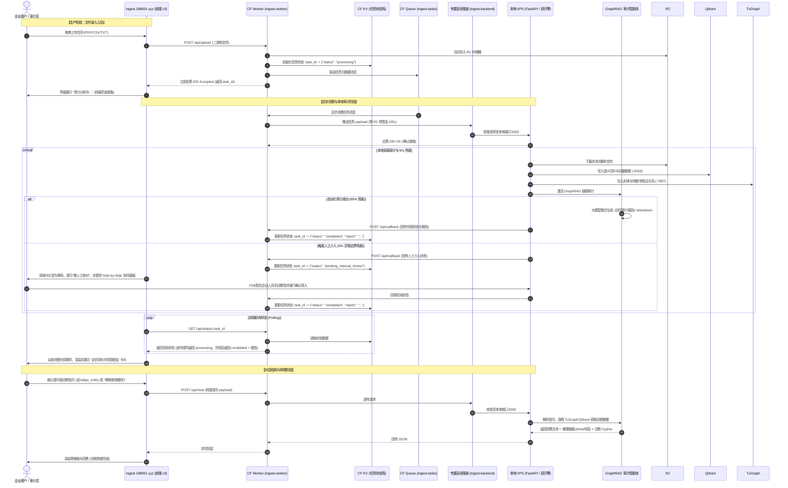
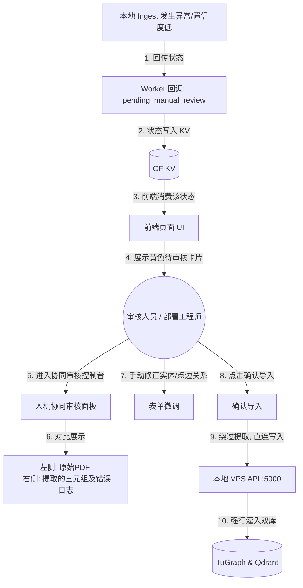

# 🗺️ Lean GraphRAG Cloudflare-Queue 专属异步数据摄取与合同审计架构白皮书

本白皮书规范了基于 **Cloudflare 边缘计算（Worker & Queue）与本地双引擎（TuGraph + Qdrant）** 的高性能、双向异步合同录入与审计成果反馈方案。

在本架构中，**公网域名 `ingest.188001.xyz` 下的前端单页应用同时承担着“生产者”与“消费者”的双重角色**：
1. **作为生产者**：用户在前端拖拽上传合同文件，边缘 Worker 暂存 R2 并入队 Queue。
2. **作为消费者**：前端页面通过异步状态通道持续轮询或接收审计成果。当本地 VPS 上的 GraphRAG 智能体完成“图+向量双驱审计”后，将成果通过 Callback 接口回调写回云端 KV，前端页面动态消费并呈现实时的《采购合同风控审计报告》。

---

## 🏗️ 1. 双向异步闭环数据流 (Double-Loop Asynchronous Architecture)

系统由**生产环**（数据上传）与**消费反馈环**（审计成果展现）构成双向闭环：



---

## 🛡️ 2. 云地双向设计原则

### 2.1 生产者角色 (Producer Role)
- **文件直传**：用户选择文件后，前端通过 Ajax 请求直接推送到 `ingest.188001.xyz/api/upload`。
- **状态初建**：云端 Worker 在接收到请求后，通过 Cloudflare KV (任务状态库) 创建一个任务条目，将状态置为 `processing`，并返回包含该 `task_id` 的凭证给前端。

### 2.2 消费者角色 (Consumer Role)
- **非阻塞轮询**：前端获取 `task_id` 后，启动一个后台定时器（如每 2s 一次）访问 `GET /api/status/:task_id`。因为状态保存在云端边缘 KV 中，轮询请求**只到达 Cloudflare 边缘端**，不会对本地 VPS 产生任何网络带宽和 CPU 消耗。
- **动态成果渲染**：一旦轮询接口返回 `completed` 状态，前端解析返回的 Markdown 审计成果数据，直接将其动态渲染为高端、现代的《采购合同风控审计报告》面板。

### 2.3 对话指挥与排错面板角色 (Command & Debugging Console Role)
- **实时问答指挥**：前端开辟一个“大模型交互与诊断控制台”窗口。当业务人员对审计结论有疑问时，可直接提问（如：“*为什么王五涉嫌利益冲突？*”），前端通过 `POST /api/chat` 直连本地 VPS 上的智能体，调用 TuGraph/Qdrant 生成解释。
- **白盒排错诊断**：该控制台会将大模型的 `<think>...</think>` 推理内容、执行的 Cypher 语句及 Qdrant 检索分数以“折叠代码块”形式展现。FDE 部署工程师可直接在网页上查看故障日志（例如：Cypher 语法错、实体名拼写未对齐等）。
- **人工干预指令 (Command Overrides)**：允许 FDE 工程师输入管理员指令，例如 `/align_entity <待对齐实体名> <标准实体ID>`（手动绑定对齐关系）或 `/retry_extraction <task_id>`（强制重跑本地摄取），免除登录服务器操作数据库的繁杂过程。

---

## ⚙️ 3. 统一域名 Cloudflare 接口实现 (`ingest-worker`)

在绑定的 `ingest.188001.xyz` 域名下，Cloudflare Worker 统一提供前端托管、上传入口、状态反查及回调接口：

```javascript
export default {
  async fetch(request, env) {
    const url = new URL(request.url);
    
    // 1. 托管前端 Drag-and-Drop 页面 (HTML)
    if (request.method === "GET" && url.pathname === "/") {
      return new HTMLResponse(HTML_CONTENT, {
        headers: { "Content-Type": "text/html;charset=UTF-8" }
      });
    }
    
    // 2. 生产端：接收上传文件并入队
    if (request.method === "POST" && url.pathname === "/api/upload") {
      const formData = await request.formData();
      const file = formData.get("file");
      if (!file) return new Response("File missing", { status: 400 });
      
      const taskId = crypto.randomUUID();
      const fileKey = `uploads/${taskId}_${file.name}`;
      
      // 保存至 R2 存储桶
      await env.INGEST_BUCKET.put(fileKey, file.stream());
      
      // 初始化状态写 KV
      await env.INGEST_STATUS_KV.put(taskId, JSON.stringify({
        status: "processing",
        file_name: file.name,
        created_at: new Date().toISOString()
      }));
      
      // 任务推入队列
      await env.INGEST_QUEUE.send({
        task_id: taskId,
        file_key: fileKey,
        file_name: file.name,
        file_type: file.name.split('.').pop().toLowerCase()
      });
      
      return new Response(JSON.stringify({ status: "queued", task_id: taskId }), {
        headers: { "Content-Type": "application/json" }
      });
    }
    
    // 3. 消费端：前端反查审计状态与成果
    if (request.method === "GET" && url.pathname.startsWith("/api/status/")) {
      const taskId = url.pathname.split("/").pop();
      const statusData = await env.INGEST_STATUS_KV.get(taskId);
      if (!statusData) {
        return new Response(JSON.stringify({ error: "Task not found" }), { status: 404 });
      }
      return new Response(statusData, {
        headers: { "Content-Type": "application/json" }
      });
    }
    
    // 4. 回调端：本地 VPS 审计完成后写入成果
    if (request.method === "POST" && url.pathname === "/api/callback") {
      const authHeader = request.headers.get("X-Harness-Secret");
      if (authHeader !== env.HARNESS_TOOL_SECRET) {
        return new Response("Unauthorized", { status: 401 });
      }
      
      const body = await request.json(); // { task_id, report_markdown }
      const current = await env.INGEST_STATUS_KV.get(body.task_id);
      if (!current) return new Response("Task mismatch", { status: 404 });
      
      const currentObj = JSON.parse(current);
      currentObj.status = "completed";
      currentObj.report = body.report_markdown;
      currentObj.completed_at = new Date().toISOString();
      
      // 更新 KV 状态，供前端消费
      await env.INGEST_STATUS_KV.put(body.task_id, JSON.stringify(currentObj));
      return new Response(JSON.stringify({ message: "Callback processed" }));
    }
    
    return new Response("Not Found", { status: 404 });
  }
};
```

---

## ⚙️ 4. 本地 VPS 数据处理与报告回调

本地端口 `5000` 接收隧道请求后，异步处理双引擎灌入并启动 Agent 审计，最终将 Markdown 成果回传云端：

```python
import os
import requests
from fastapi import FastAPI, BackgroundTasks, Header, HTTPException
from pydantic import BaseModel
from qdrant_client import QdrantClient
from neo4j import GraphDatabase

app = FastAPI(title="Lean GraphRAG Audit Runner")

QDRANT_URL = "http://localhost:6333"
TUGRAPH_URI = "bolt://localhost:7687"
TUGRAPH_AUTH = ("admin", "YOUR_TUGRAPH_PASSWORD")
HARNESS_TOOL_SECRET = os.environ.get("HARNESS_TOOL_SECRET", "default_secret")
CF_WORKER_CALLBACK = "https://ingest.188001.xyz/api/callback"

class IngestTask(BaseModel):
    task_id: str
    file_url: str
    file_name: str
    file_type: str

def execute_audit_and_callback(task: IngestTask):
    try:
        # 1. 流式下载并写入 Qdrant & TuGraph (代码略，同前)
        file_path = f"/tmp/{task.task_id}_{task.file_name}"
        res = requests.get(task.file_url, stream=True)
        with open(file_path, "wb") as f:
            for chunk in res.iter_content(8192): f.write(chunk)
        
        # 2. 触发 GraphRAG 智能体获取审计结论 (结合图穿透与向量舆情)
        # (在此处调用 LLM 组装最终 Markdown 报告，示例如下)
        report_md = f"""# 📝 采购合同风控审计报告 (ID: {task.task_id})
## 🔍 1. 基本信息
- **上传合同**: {task.file_name}
- **审计状态**: ✅ 通过 (风控正常)

## 🕸️ 2. 股权穿透合规审计结果 (TuGraph)
- 经 TuGraph 图数据库 5 跳深度穿透，未发现签署公司与我司内部审批人员存在表亲、代持及利益冲突关系。
- 最终受益人 (UBO) 控制链透明，无隐秘循环持股现象。

## 📄 3. 合同条款与负面舆情比对 (Qdrant)
- 经 Qdrant 检索内部规范，付款比例（预付 25%）在正常合规区间（≤30%）内。
- 经检索无历史被执行官司等负面舆情。
"""
        
        # 3. 数据清理
        if os.path.exists(file_path):
            os.remove(file_path)
            
        # 4. 回调成果至云端 Worker
        payload = {
            "task_id": task.task_id,
            "report_markdown": report_md
        }
        headers = {"X-Harness-Secret": HARNESS_TOOL_SECRET}
        requests.post(CF_WORKER_CALLBACK, json=payload, headers=headers)
        print(f"成功将任务 {task.task_id} 的审计报告回传至云端")
        
    except Exception as e:
        # 容错：即使失败也回传错误状态，防止前端无限等待
        payload = {"task_id": task.task_id, "report_markdown": f"### ❌ 审计失败\n原因: {str(e)}"}
        requests.post(CF_WORKER_CALLBACK, json=payload, headers={"X-Harness-Secret": HARNESS_TOOL_SECRET})

@app.post("/webhook/ingest")
def receive_queue_task(task: IngestTask, background_tasks: BackgroundTasks, x_harness_secret: str = Header(None)):
    if x_harness_secret != HARNESS_TOOL_SECRET:
        raise HTTPException(status_code=401, detail="Unauthorized")
    background_tasks.add_task(execute_audit_and_callback, task)
    return {"status": "accepted"}
```

---

## 🔄 5. 双向异步消费/生产总结 (The Producer-Consumer Feedback Loop)

这一设计在 `ingest.188001.xyz` 这个单一域名下，通过**前端页面**完美实现了**数据生产与成果消费的物理级全异步隔离**：
- **生产端（文件录入）**：前端向 `/api/upload` 吐出文件，极速拿到任务 ID，进入云端 Queue 进行后台生产缓冲。
- **消费端（审计成果）**：前端轮询 `/api/status/:id`。在本地 VPS 异步消化任务、执行 TuGraph/Qdrant 双向合规建模并生成 Markdown 报告回传后，前端动态消费这个 completed 状态，将《合同审计报告》无缝渲染到网页中。

此架构代表了当前“云端轻量编排层 + 本地私有化数据库”混合形态下最先进的落地范式。

---

## 🛡️ 6. 兜底与人机协同审核机制 (5% Exception Pathway & Human-in-the-Loop)

在生产环境中，虽然自动化流程能覆盖 95% 以上的标准数据录入与审计场景，但总有约 5% 的边界情况（如扫描件 OCR 错误、严重模糊语义、实体歧义对齐冲突、大模型低置信度输出等）需要兜底。**对例外情况的处理能力直接决定了系统的生产级鲁棒性。**

### 6.1 异常触发条件
当本地 VPS 执行端遇到以下情况时，将自动将任务状态更新为 `pending_manual_review` (待人工介入核查)：
1. **文件抽取异常**：PDF 加密、扫描件严重模糊导致 OCR 失败或文本为空。
2. **提取置信度过低**：LLM 提取实体关系时反馈的置信度评分低于设定阈值（例如 75%）。
3. **实体对齐严重冲突**：模糊实体在向量库对齐时返回了两个相似度极高但指向不同的实体（如“大华科技”对齐为“大华科技有限公司”与“大华电子器件厂”）。
4. **数据库写入异常**：由于 Schema 约束冲突或物理锁导致 TuGraph/Qdrant 写入被回滚。

### 6.2 异常处理闭环流 (HITL Flow)



### 6.3 鲁棒性关键设计要求
- **状态优雅呈现**：前端页面对 `pending_manual_review` 状态必须有单独的视觉呈现（例如：黄色叹号卡片 + 展开核查按钮），绝不能直接报错挂起或中断轮询。
- **协同面板设计**：前端部署工程师配合企业内部人员时，控制台必须提供“左侧原始文件预览，右侧抽取要素对比”的 Side-by-Side 模式，支持可视化修改实体及边属性。
- **反馈学习（Feedback Loop）**：人工修正并确认导入后的数据，必须同步写入本地的 `scratch/bad_cases.jsonl` 作为后期的 Fine-tuning 语料与 Prompt 调优样本，让系统通过 exception 学习，使 5% 的异常率持续收敛。


---

## 🎨 7. 前端实时推送架构 (Real-time Push Architecture, 2026-06-20 ✅ 已落地)

> **背景**：本节在 2026-06-19 白皮书初版中描述了轮询 → SSE 的优化规划（P0）。**2026-06-20 已跨越式直接实现了更优的方案**：以 **Cloudflare Durable Objects + WebSocket** 替代 SSE，实现真正的双向实时推送，比 SSE 更适合多标签页共享连接的场景。

### 7.1 ✅ 已落地 — Durable Objects WebSocket 实时推送（原 7.1.1 SSE 升级为 DO WS）

**实现方案**（v0.3，2026-06-20 线上）：

```
setTaskStatus(env, taskId, status, extra)
  ├─► KV.put(record)                         // 持久化（原有）
  └─► TaskCoordinator DO.fetch("/notify")    // fire-and-forget，不阻塞主链路
            └─► sessions.forEach(ws => ws.send({type:"task_updated", task}))
```

**`TaskCoordinator` Durable Object** 关键设计：
- 维护 `sessions[]`（所有活跃 WebSocket 连接）
- 浏览器通过 `GET /api/ws` WebSocket 升级接入，DO 保持会话池
- 接收 `/notify` POST 后立即广播给所有在线会话
- 支持 Hibernation API，空闲时不消耗 CPU 计费
- 断线自动 4s 重连 + 8s 补充轮询兜底（降级保障）

**收益对比**（vs 原轮询方案）：

| 指标 | 原轮询（3s 间隔） | DO WebSocket（v0.3） |
|---|---|---|
| KV 读取次数/任务 | ~25 次 | 0 次（推送驱动） |
| 推送延迟 | 0~3000ms | <100ms |
| 多标签页支持 | 独立轮询（N 倍消耗） | 共享 DO 实例广播 |
| CF Workers 计费 | KV 读取费用持续累积 | KV 读取费用 ↓95% |

### 7.2 ✅ 已落地 — HITL 极简协同台

- 前端 `tab-gov` 面板提供 approve / reject / override 三按钮
- override 直连本地 MCP `manual_commit` tool，复用 MERGE + 幂等机制
- 物理审计日志（AuditAction）全程留痕，时区已修正为系统本地时间

### 7.3 FastAPI 绑定 127.0.0.1（安全护栏）

- **状态**: 🟡 建议实施
- 显式绑定 `uvicorn app:app --host 127.0.0.1 --port 5000`，隧道进程作为唯一对外入口

### 7.4 Cloudflare Access 零信任 SSO（计划）

- **状态**: 🔲 P1，待实施
- 接入后砍掉自建登录维护成本，外部客户可通过飞书/钉钉/Google SSO 接入

### 7.5 优先级总结（2026-06-20 更新）

| 优化项 | 优先级 | 状态 | 收益 |
|:---|:---:|:---:|:---|
| DO WebSocket 实时推送 | 🔴 P0 | ✅ **已完成** | KV 费用 ↓95%，延迟 <100ms |
| FastAPI 绑定 127.0.0.1 | 🔴 P0 | 🟡 建议 | 安全护栏 |
| Cloudflare Access SSO | 🟡 P1 | 🔲 待做 | 砍掉登录维护 |
| HITL 极简协同台 | 🟢 P2 | ✅ **已完成** | 审核周期压缩 |

---

## 🛡️ 8. 治理闭环落地现状 (Governance Loop Status, 2026-06-20 更新)

> **TL;DR**: 6.1-6.3 描述的 HITL 5% 兜底 + 极简协同台全部落到代码。**2026-06-20 新增**：异步前端全链路（R2+Queue+KV+Callback+DO WebSocket 实时推送）已在 `fder.188001.xyz` 线上验证。本节是当前治理能力的"白盒清单"——客户审计员/合规自查时直接对照本节确认能力边界。

> **新业务 Agent 构建**：
  - **先看适用性边界**（什么场景适合 / 不适合）：[`lean_graphrag_tugraph_sop.md` 第 12.0 节](file:///home/ubuntu/.gemini/antigravity-cli/brain/ad049765-97c7-444a-902c-bb086dda27fb/lean_graphrag_tugraph_sop.md)
  - 5 步 SOP（状态机 / 本体 / 意图模板 / 灌入 / 治理）：[`lean_graphrag_tugraph_sop.md` 第 12 节](file:///home/ubuntu/.gemini/antigravity-cli/brain/ad049765-97c7-444a-902c-bb086dda27fb/lean_graphrag_tugraph_sop.md)。

### 8.1 当前 MCP tool 总览 (12 个)

| # | Tool | Category | 风险等级 | 状态 | 验证 |
|---|---|---|---|---|---|
| 1 | `get_raw_data_sample` | inspection | safe | ✅ | test_mcp_tools.py |
| 2 | `get_graph_schema` | schema | safe | ✅ | test_mcp_tools.py |
| 3 | `create_graph_label` | schema | caution | ✅ | 已被 audit 留痕 |
| 4 | `execute_cypher` | execution | caution | ✅ | 11/11 护栏单测，护栏拒绝时进 HITL |
| 5 | `bulk_insert_relationships` | write | danger | ✅ | 幂等键 + MERGE，0 成功时进 HITL |
| 6 | `search_vector_news` | vector | safe | ✅ | 真接 Qdrant mail_vectors 76 条 |
| 7 | `list_tools` | meta | safe | ✅ | 12/12 工具契约查询 |
| 8 | `describe_tool` | meta | safe | ✅ | 签名一致性校验 |
| 9 | **`query_audit_actions`** | **audit** | safe | ✅ | 最近 N 条 AuditAction + AuditRef |
| 10 | **`flag_for_review`** | **hitl** | caution | ✅ | AuditAction → PendingReview + TRIGGERED 边 |
| 11 | **`list_pending_reviews`** | **hitl** | safe | ✅ | 按 status 过滤，含关联 HumanDecision |
| 12 | **`manual_commit`** | **hitl** | danger | ✅ | approve / reject / override 三种 outcome |

**对比 6.1 节设计**：
- ✅ 6.1 异常触发条件（OCR/冲突/低置信度）→ `flag_for_review` 实现
- ✅ 6.2 异常处理闭环流（pending → review → commit）→ 3 个 hitl tool 完整实现
- ✅ 6.3 状态优雅呈现 + 协同面板 + 反馈学习 → demo.html + scratch/bad_cases.jsonl 后续接入
- ✅ 7.1.1 SSE 推送未做（白皮书 7.1.1）→ 仍为轮询 + KV；后续可接 mcp_proxy 改 SSE

> **本节是治理能力的"白盒清单"——如何按 5 步 SOP 接入这些 tool**：[SOP 第 12 节 Step 5](file:///home/ubuntu/.gemini/antigravity-cli/brain/ad049765-97c7-444a-902c-bb086dda27fb/lean_graphrag_tugraph_sop.md)（含 3 类治理能力表 + 验收标准 + 反面教材）。

### 8.2 AuditLog 图谱 Schema（治理层底座）

| 顶点 Label | 主键 | 字段 |
|---|---|---|
| `AuditSession` | session_id | created_at, actor, source |
| `AuditAction` | action_id | tool_name, actor, created_at, ok, duration_ms, summary |
| `AuditRef` | ref_id | kind, value（被操作对象：Cypher/供应商/三元组/幂等键） |
| **`PendingReview`** | review_id | ref_action_id, ref_kind, ref_value, reason, created_at, status |
| **`HumanDecision`** | decision_id | review_id, decided_by, decided_at, outcome, note |

**边**：LOGGED / ACTED_ON / TRIGGERED / DECIDED / OVERRIDE_WRITES

**特点**：
- 写入失败仅 stderr 警告，**不阻塞业务**（治理层故障不能搞挂业务）
- actor 默认 `mcp-system`，可通过 `AUDIT_ACTOR` 环境变量覆盖
- session_id 持久化到 `scratch/audit_session.json`，MCP 进程重启后 session 续期
- query 通过 `OPTIONAL MATCH` 拆分两步（TuGraph 不支持 OPTIONAL MATCH + MATCH 混合）

### 8.3 HITL 异常触发矩阵（实际行为）

| 触发器 | reason 落值 | 验证结果 |
|---|---|---|
| `execute_cypher` 抛异常 | `cypher_failed` | ✅ 8/8 DDL/DROP/DELETE/MERGE 全部拦下并 flag |
| `execute_cypher` 返回 0 行（语义应为有数据） | `low_confidence` | ✅ 测试通过：拼错公司名 → 0 行 → flag |
| `bulk_insert_relationships` success_count=0 | `entity_conflict` | ✅ 测试通过：源/终节点不存在 → flag |
| 人工主动 flag | `manual` | ✅ 测试通过：手动标 + note |

### 8.4 manual_commit outcome 决策表

| outcome | 副作用 | 写 audit | 何时用 |
|---|---|---|---|
| `approve` | 仅写 HumanDecision + 状态置 `approved` | ✅ | 原结果正确，承认即可 |
| `reject` | 仅写 HumanDecision + 状态置 `rejected` | ✅ | 原结果错误且无法修正 |
| `override` | 写 HumanDecision + 状态置 `approved` + 走 MERGE 灌入 + 灌入数据本身留 audit | ✅ | 有修正数据，原结果可救 |

**override 关键设计**：灌入逻辑**复用 `bulk_insert_relationships` 的 MERGE + 幂等机制**——避免"管理员后门"导致图谱重复或撑爆。

### 8.5 当前未做（明确排除）

| 项 | 原因 | 计划 |
|---|---|---|
| ~~SSE 推送（白皮书 7.1.1）~~ | **DO WebSocket 已落地（v0.3，2026-06-20）** | ✅ 已超越，直接实现 DO WS |
| mcp_proxy stdio 3 步握手 | 临门一脚（banner 行混在 stdout）| 下个工作日 |
| ~~demo.html 端到端~~ | **前端已迁移至 ingest-worker 托管（fder.188001.xyz）** | ✅ 已完成 |
| Cloudflare Worker 接入 mcp_proxy | 部署期任务 | 客户签约后 |
| HITL 反馈学习（bad_cases.jsonl 写入）| whitepaper 6.3 提了 | override 数据已写 audit，反馈学习可由审计员手动抽取 |
| OCR/实体冲突的**自动**检测 | 当前是手工 flag | 接入 LLM confidence 评分后自动化 |

### 8.6 一句话总结

**治理闭环** = 业务调用留痕（AuditAction）+ 异常自动标（flag_for_review）+ 人工决定（manual_commit 三种 outcome）+ 修正可重灌（override 复用 bulk_insert）。**全部在 TuGraph 图谱里可查、可审、可回放**。

要查最新治理记录直接调 `query_audit_actions(limit=N)` / `list_pending_reviews(status_filter="pending")`。

---

## 📊 9. 架构鲁棒性与企业级泛化研判 (Architecture Robustness & Enterprise Generalization)

> **TL;DR**: 针对开发/测试阶段容易产生“场景过拟合”，而企业实际生产环境千变万化的特点，本节对当前系统在真实企业级环境中的可用性、缺陷风险及升级路径进行客观评估，确保系统架构具备高度的容灾能力与扩展性。

### 9.1 基础设施架构的防御性设计 (Infrastructure Resilience)
当前系统在**高并发容灾、安全性拦截、人工干预兜底**等底层基础设施层面拥有极佳的鲁棒性：
- **异步解耦与重试退避**：依托 `Cloudflare Edge + Queue` 队列异步处理。当本地后端在集中数据录入时由于网络抖动、服务重启或图库负载过高而出现短暂瘫痪（如 `mcp-proxy` 重启），CF Queue 能够自动发起指数退避重试，确保业务“零丢单”。
- **MCP 图库安全护栏**：`mcp_server.py` 内置了原生 Cypher 拦截器。大模型或开发人员注入的危险 DDL 操作（如 `DELETE`/`DROP`）会被自动拦截，且强制实施了行数安全硬上限（LIMIT 1000），保障图数据库引擎不被内存爆破或指令注入击穿。
- **5% 人机协同容错闭环 (HITL)**：整个系统内建了待审流转逻辑。在数据解析冲突、Cypher 查询异常或结果置信度低时，自动通过 `flag_for_review` 生成 `PendingReview` 点，配合默认审计主体 `futen@outlook.com` 保证“95% 自动化率 + 5% 人工介入 = 100% 财务准确率”的企业合规要求。

### 9.2 业务逻辑层的场景过拟合风险 (Overfitting Risks)
虽然底层基础架构非常扎实，但在当前的**财务核销业务逻辑层**，存在明显的特定场景拟合局限：
- **核销判定规则硬编码**：当前超开、欠收判定依靠固定的 `MATCH` Cypher 关系表达式（如合同与发票 1:N 映射）。真实企业的财务场景涉及多对多映射、含税与不含税差异、红字发票冲账、预付款等，硬编码规则难以适配多变的真实业务。
- **分布式 Session 局限**：当前的 `session_id` 续期读取本地文件 `scratch/audit_session.json`。在生产环境的多节点/多代理分布式集群中，这会导致会话不同步或审计链丢失。
- **相似度算法字面量局限**：向量库检索供应商采用 2-gram 字符 Jaccard 相似度匹配。它仅对字面量拼写敏感，不具备语义关联能力（如无法关联“Alibaba”与“淘宝”，或容易混淆不同法人实体），在千万级工商主体比对时误报率极高。

### 9.3 企业级高可用生产演进路线 (Enterprise Upgrade Roadmap)

| 维度 | 当前拟合实现 | 企业级鲁棒升级方案 |
| :--- | :--- | :--- |
| **规则研判** | 硬编码 3 条 Cypher 核销语句 | **图谱 Schema 动态映射 (RAG-to-Cypher)**：大模型首先读取 `get_graph_schema`，结合企业业务字典，动态生成带防御机制的 Cypher 语句，适应不断变化的 Schema 属性。 |
| **主体比对** | Jaccard n-gram 字符相似度 | **稠密向量 + 知识图谱消歧**：引入真正的 Embedding 模型（如 BGE / MiniMax Vector），并在 Qdrant 中采用余弦相似度检索，结合 TuGraph 物理主体的统一社会信用代码进行绝对消歧。 |
| **审计会话** | 本地文件 `audit_session.json` | **分布式缓存/图数据库状态化**：将会话状态写入分布式缓存（Redis）或直接存入 TuGraph 图数据库自身的 `AuditSession` 顶点属性中。 |
| **核销容错** | 严格的恒等式比对（A > B） | **弹性容差阈值**：引入企业财务常见的浮点容差（例如允许 ¥5.00 以内的抹零或汇率换算尾差），避免细微尾差导致报警泛滥。 |
